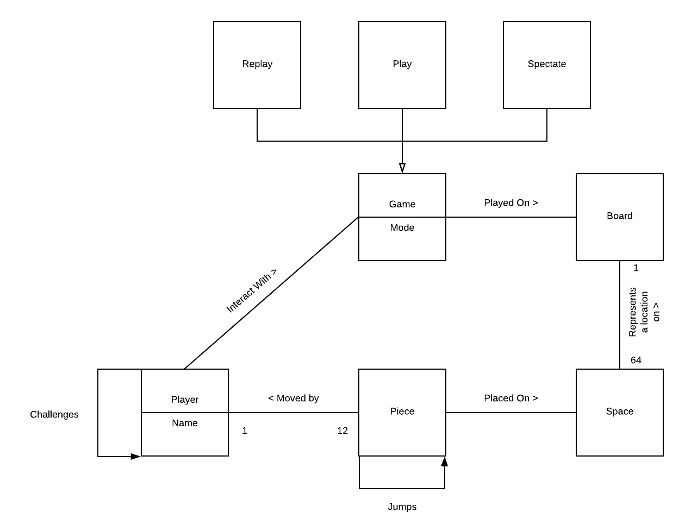

# PROJECT Design Documentation

## Team Information
* Team name: Banana
* Team members
  * Hersh Nagpal
  * Michael Kha
  * Luis Gutierrez
  * Matthew Bollinger
  * Christopher Daukshus

## Executive Summary

WebCheckers is a web-based version of the game of checkers built using the
Spark web framework and the FreeMarker template engine that is run on Java8.

### Purpose
The goal of this project is to have a functional application that allows users
to play a game of checkers with other users. Users select an opponent or wait
to be selected to begin a game within the player lobby. Players can expect to
play under the American rules for checkers until a player wins or resigns.

### Glossary and Acronyms
| Term | Definition |
|------|------------|
| VO | Value Object |
| MVP | Minimum Viable Product |
| UI | User Interface |

## Requirements

This section describes the features of the application.

### Definition of MVP
WebCheckers is an application in which players can challenge each other to
checkers games over the internet. Players will be able to log in to a website 
and see a list of other players who are online. Clicking a player will challenge
them to a game of checkers. If they accept, a game of checkers will be created.
The game will follow the regulations of American Checkers. Players can resign at
any time.

### MVP Features
- Player Sign-In
- Player Sign-Out
- Start A Game
- Piece Movement
  * Normal Move
  * Jump Move
  * Multiple Jump Move
- King Pieces
- End Game
  * Player Resigns
  * All Pieces Eliminated
  * No More Valid Moves

### Roadmap of Enhancements
1. AI Player: Players may play a game against an artificial intelligence player.
2. Replay Mode: Games can be stored and then reviewed at a later date.
3. Player Help: Extend the Game View to support the ability to request help.
4. Spectator Mode: Other players may view an on-going game that they are not playing.
5. Asynchronous Play: Players can play asynchronously.
6. Multiple Games: A player may play more than one game at a time.
7. Tournament Play: Players can enter into checkers tournaments including player statistics.

## Application Domain

This section describes the application domain.

Players sign in to play the game of checkers. The game is played on a standard 8x8
checkers board. The pieces are located on individual spaces. Players play against
another player, taking turns moving pieces and capturing their opponents pieces.

## Architecture and Design

This section describes the application architecture.

### Summary

The following Tiers/Layers model shows a high-level view of the webapp's architecture.

As a web application, the user interacts with the system using a
browser.  The client-side of the UI is composed of HTML pages with
some minimal CSS for styling the page.  There is also some JavaScript
that has been provided to the team by the architect.

The server-side tiers include the UI Tier that is composed of UI Controllers and Views.
Controllers are built using the Spark framework and View are built using the FreeMarker framework.
The Application and Model tiers are built using plain-old Java objects (POJOs).

Details of the components within these tiers are supplied below.

### Overview of User Interface

This section describes the web interface flow; this is how the user views and interacts
with the WebCheckers application.

Users can expect to be connected to the home page where they will have the option to sign in.
Upon visiting the sign in page, users are prompted to enter a username. A username must follow
specific criteria to be valid. Once a user has signed in, they will be able to see other players
that are signed in on the home page. The user can start a game by selecting another player that
is not yet in a game. When a game starts, the user that starts the game gets to go first. Each player
takes turns making moves until a winner has been decided. A turn consists of a player making a valid
move on the board and then having a choice of confirming or undoing their move using the submit turn
and backup buttons. A player may also choose to resign from the game before making a move. When a
game of checkers is over, both users will see a message indicating the outcome of the game and now
be able to go back to the home page to start a new game.

### UI Tier
> _Provide a summary of the Server-side UI tier of your architecture.
> Describe the types of components in the tier and describe their
> responsibilities.  This should be a narrative description, i.e. it has
> a flow or "story line" that the reader can follow._

> _At appropriate places as part of this narrative provide one or more
> static models (UML class structure or object diagrams) with some
> details such as critical attributes and methods._

> _You must also provide any dynamic models, such as statechart and
> sequence diagrams, as is relevant to a particular aspect of the design
> that you are describing.  For example, in WebCheckers you might create
> a sequence diagram of the `POST /validateMove` HTTP request processing
> or you might show a statechart diagram if the Game component uses a
> state machine to manage the game._

> _If a dynamic model, such as a statechart describes a feature that is
> not mostly in this tier and cuts across multiple tiers, you can
> consider placing the narrative description of that feature in a
> separate section for describing significant features. Place this after
> you describe the design of the three tiers._

#### Summary
The server-side UI tier is structured by the actions needed for displaying and updating pages.
Each route is specialized to do a task by communicating with the application tier services.
Listed below is each page and the routes that are used as well as a description.
- Home Page
  * This is the first page a user sees. They are greeted by a page that shows information depending
  on the login status of the user.
  * The GetHomeRoute handles what the page displays. If a player is not yet signed-in, they see
  the number of players online. If a player is signed-in, they see the names of other online players.
  * From the home page, a signed-in player can select another player to start a game. If both players
  a
  * The route also checks if the user is in an ongoing game to redirect them to the game page.
- Game Page
  *

### Application Tier
> _Provide a summary of the Application tier of your architecture. This
> section will follow the same instructions that are given for the UI
> Tier above._

### Model Tier
> _Provide a summary of the Application tier of your architecture. This
> section will follow the same instructions that are given for the UI
> Tier above._

### Design Improvements
> _Discuss design improvements that you would make if the project were
> to continue. These improvement should be based on your direct
> analysis of where there are problems in the code base which could be
> addressed with design changes, and describe those suggested design
> improvements. After completion of the Code metrics exercise, you
> will also discuss the resutling metric measurements.  Indicate the
> hot spots the metrics identified in your code base, and your
> suggested design improvements to address those hot spots._

## Testing
> _This section will provide information about the testing performed
> and the results of the testing._

### Acceptance Testing
> _Report on the number of user stories that have passed all their
> acceptance criteria tests, the number that have some acceptance
> criteria tests failing, and the number of user stories that
> have not had any testing yet. Highlight the issues found during
> acceptance testing and if there are any concerns._

### Unit Testing and Code Coverage
> _Discuss your unit testing strategy. Report on the code coverage
> achieved from unit testing of the code base. Discuss the team's
> coverage targets, why you selected those values, and how well your
> code coverage met your targets. If there are any anomalies, discuss
> those._
