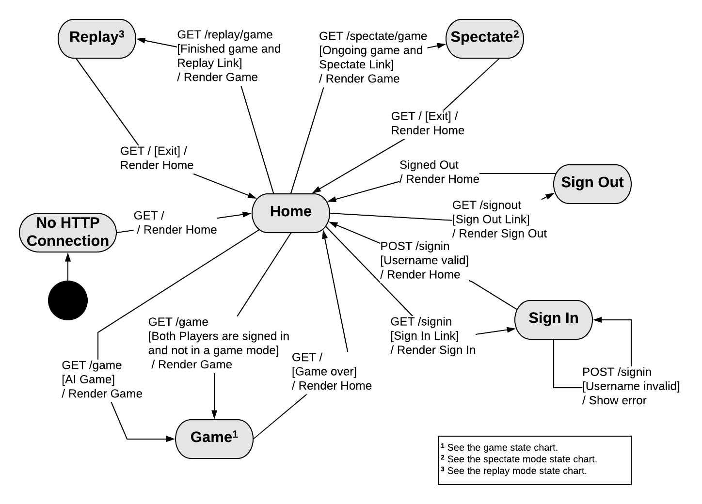
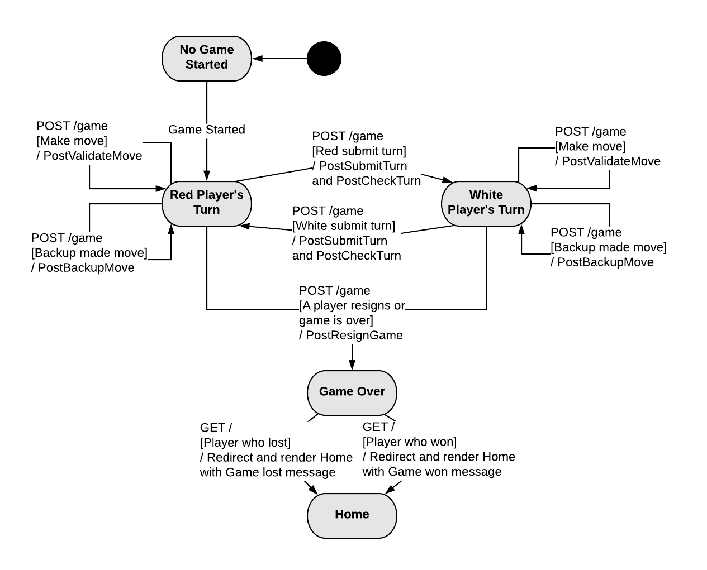

# PROJECT Design Documentation

## Team Information
* Team name: Banana
* Team members
  * Hersh Nagpal
  * Michael Kha
  * Luis Gutierrez
  * Matthew Bollinger
  * Christopher Daukshus

## Executive Summary

WebCheckers is a web-based version of the game of checkers built using the
Spark web framework and the FreeMarker template engine that is run on Java8.

### Purpose
The goal of this project is to have a functional application that allows users
to play a game of checkers with other users. Users select an opponent or wait
to be selected to begin a game within the player lobby. Players can expect to
play under the American rules for checkers until a player wins or resigns.

### Glossary and Acronyms
| Term | Definition |
|------|------------|
| VO | Value Object |
| MVP | Minimum Viable Product |
| UI | User Interface |

## Requirements

This section describes the features of the application.

### Definition of MVP
WebCheckers is an application in which players can challenge each other to
checkers games over the internet. Players will be able to log in to a website 
and see a list of other players who are online. Clicking a player will challenge
them to a game of checkers. If they accept, a game of checkers will be created.
The game will follow the regulations of American Checkers. Players can resign at
any time.

### MVP Features
- Player Sign-In
- Player Sign-Out
- Start A Game
- Piece Movement
  * Normal Move
  * Jump Move
  * Multiple Jump Move
- King Pieces
- End Game
  * Player Resigns
  * All Pieces Eliminated
  * No More Valid Moves

### Roadmap of Enhancements
1. Replay Mode: Games can be stored and then reviewed at a later date.
2. Spectator Mode: Other players may view an on-going game that they are not playing.Replay Mode: Games can be stored and then reviewed at a later date.
3. AI Player: Players may play a game against an artificial intelligence player.
4. Player Help: Extend the Game View to support the ability to request help.
5. Asynchronous Play: Players can play asynchronously.
6. Multiple Games: A player may play more than one game at a time.
7. Tournament Play: Players can enter into checkers tournaments including player statistics.

## Application Domain

This section describes the application domain.

Players sign in to play the game of checkers. The game is played on a standard 8x8
checkers board. The pieces are located on individual spaces. Players play against
another player, taking turns moving pieces and capturing their opponents pieces.

## Architecture and Design

This section describes the application architecture.

### Summary

The following Tiers/Layers model shows a high-level view of the webapp's architecture.

As a web application, the user interacts with the system using a
browser.  The client-side of the UI is composed of HTML pages with
some minimal CSS for styling the page.  There is also some JavaScript
that has been provided to the team by the architect.

The server-side tiers include the UI Tier that is composed of UI Controllers and Views.
Controllers are built using the Spark framework and View are built using the FreeMarker framework.
The Application and Model tiers are built using plain-old Java objects (POJOs).

Details of the components within these tiers are supplied below.

### Overview of User Interface

This section describes the web interface flow; this is how the user views and interacts
with the WebCheckers application.

Users can expect to be connected to the home page where they will have the option to sign in.
Upon visiting the sign in page, users are prompted to enter a username. A username must follow
specific criteria to be valid. Once a user has signed in, they will be able to see other players
that are signed in on the home page. The user can start a game by selecting another player that
is not yet in a game. When a game starts, the user that starts the game gets to go first. Each player
takes turns making moves until a winner has been decided. A turn consists of a player making a valid
move on the board and then having a choice of confirming or undoing their move using the submit turn
and backup buttons. A player may also choose to resign from the game before making a move. When a
game of checkers is over, both users will see a message indicating the outcome of the game and now
be able to go back to the home page to start a new game.

### UI Tier
The server-side UI tier is structured by the actions needed for displaying and updating pages.
Each route is specialized to do a task by communicating with the application tier services.
Provided below is each page and the routes that are used as well as a description.

#### Pages
- Home Page
  * This is the first page a user sees. They are greeted by a page that shows information
   depending on the login status of the user.
  * The GetHomeRoute handles what the page displays. If a player is not yet signed-in, they see
  the number of players online. If a player is signed-in, they see the names of other online players.
  * From the home page, a signed-in player can select another player to start a game. If the
  other player is already in a game then no game is started and the user is informed by a message.
  * The route also checks if the user is in an ongoing game to redirect them to the game page.
- Sign-In Page
  * Upon clicking the sign-in link in the navigation bar, the user go to the sign-in page by the GetSignInRoute.
  * The user will proceed to enter a name into the sign-in form. PostSignInRoute makes sure that the
  username is valid in all cases (the name has not been taken and follows the sign-in conventions).
  * Once the user enters a valid name, PostSignInRoute redirects the now logged-in player back to the home page.
- Game Page
  * Players will see the board view representation of the board that is oriented to the bottom of the grid.
  * The turn is checked by the PostCheckTurnRoute every 5 seconds by an ajax call.
  * When a player makes a move on the board, the PostValidateMoveRoute makes sure that the move is valid.
  * After making a valid move, a player will then have the choice of submitting the turn or backing up
  from the move. These actions are handled by the PostSubmitTurnRoute and PostBackupMoveRoute.
  * At any point of the game, a player can resign from the game and return to the home page.
  The other player will see a message indicating that this player resigned.
  

### Application Tier
The application tier facilitates interactions between the game objects of the model and the server and
client communication of the UI. When the UI requires access to the model classes, whether to create,
alter, or display them, the UI first goes through the correct application tier manager class.

#### Services
- GameCenter
* Each route located in the UI tier uses GameCenter to get information from game objects in the model package.
  GameCenter creates and manages games by storing them in a list of ongoing games and ended games. Given that
  the games are managed in this class, we adhere to both the information expert and single responsibility design
  principles as we contain the responsibility of getting the current player's game and calling the appropriate method
  from that game in GameCenter. The following are examples of how GameCenter connects UI tier routes to games.
    1. PostSubmitTurnRoute requires a message communicating whether the player's submit action is valid or not. The
    route calls the method "submitTurn" in gameCenter that gets the player's game and returns the appropriate message.
    2. PostCheckTurnRoute requires a message communicating whether the player's opponent has submitted a turn. The
    route calls the method "checkTurn" in gameCenter that gets the player's game from the list of games and returns the
    appropriate message.
    3. GetGameRoute must acquire the game object that the session's player started in order to render the game page
    by first checking if the session's player is in a game already. The route checks if this is true using the method
    playerInGame(player) in gameCenter which uses the list of games that exist to check if player is in one of them.
    GetGameRoute also uses the method getGame(player) to get the game object from a player already in a game in order
    to render the game. The route also uses the methods isGameOver and isWinner in gameCenter to display the
    appropriate message given that a player resigns.
    4. PostValidateRoute goes through the same steps of acquiring the correct message (ValidMove or InvalidMove) by
    by using GameCenter to return the correct message obtained by calling validateMove() in Messenger, which uses Game
    to return true or false depending on whether the move follows the American Checkers rules.
    
- Messenger
  * Many routes require appropriate messages to display depending on system events like valid/invalid move, opponent
  resignation, or player resignation. The class Messenger was created to hold all messages needed to be displayed for
  all system events. Routes that require messages from messenger go through gameCenter which will call the appropriate
  messenger method. Messenger methods will in turn return the appropriate message by checking game state through a game
  object.

### Model Tier
The model tier is a collection is a collection of objects and types that make up the basic structure
of the checkers game. The Board, Space, and Piece classes are examples of game objects. Color,
MessageType, and ViewMode are examples of types that describe other objects or states that objects
can be in. The main hierarchy of the board is contained in the Board class.

### Design Improvements
Previously, the Game class contained over 660 lines of code. Many of these lines were used for the
implementation of the piece movement feature. As a team, we have discussed creating a separate class
dedicated to piece movement in order to clean up the look of the class. This would increase cohesion,
but a new class would have to be made. The benefit of this class being made would have had to outweigh
the hassle of documentation, lack of readability, and length of the Game class. Another solution is
to delegate piece movement to a class that already exists but is much shorter. The Move class is an
example of this type of class. However, Move is a class that specifically creates an object with values.
To put logic in this class would lower is cohesiveness.
The team made the decision to delegate much of the validation of moves into a fabricated class called
MoveManager, which reduced the number of lines of code in the Game class substantially. It is now a
more cohesive class and despite having more dependencies and higher coupling, the benefits of having a
more readable and singularly purposed Game class far outweighs the new dependency and the effort put in.
Many of the methods in the Game class were also found to be a better fit within other classes, such as
a method that returns all of the pieces that can make moves on the Board. Methods such as these were
moved out of the Game class and into more appropriate classes.

## Testing
Tests were performed mainly by running the game server and manually creating situations in which the
code could be tested. After the feature was verified to be working ideally in game, each conditional
branch that could be reached through unit testing reasonably. Code coverage and unit tests are
discussed further in the below sections.

### Acceptance Testing
All user stories have passed except for two (33/35). The failed tests are part of the "All Pieces Eliminated"
feature. This feature was worth 2 story points and is the only feature for this sprint that is not complete.

### Unit Testing and Code Coverage
Our testing strategy was to use as many cases as possible to ensure all conditional paths are traversed
by the testing. Every possible case is tested unless it is simple enough to be falsifiable by eye.
Coverage targets were chosen based on the ease by which classes could be tested and all conditional
paths traversed. Lower coverage targets indicates that the tier had more difficult code to traverse in tests.

Coverage targets:
Model - 90%
UI - 80%
Application - 80%